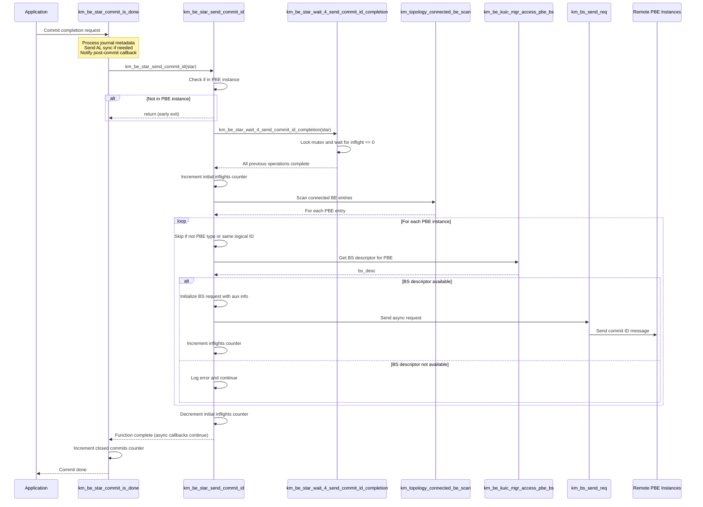

# Main Commit Flow Sequence Diagram

This diagram shows the high-level flow from commit completion to sending commit IDs to other PBE instances.

```mermaid
sequenceDiagram
    participant App as Application
    participant CommitDone as km_be_star_commit_is_done
    participant SendCommit as km_be_star_send_commit_id
    participant Wait as km_be_star_wait_4_send_commit_id_completion
    participant Topology as km_topology_connected_be_scan
    participant KUIC as km_be_kuic_mgr_access_pbe_bs
    participant BS as km_bs_send_req
    participant PBE as Remote PBE Instances

    App->>CommitDone: Commit completion request
    Note over CommitDone: Process journal metadata<br/>Send AL sync if needed<br/>Notify post-commit callback
    
    CommitDone->>SendCommit: km_be_star_send_commit_id(star)
    
    SendCommit->>SendCommit: Check if in PBE instance
    alt Not in PBE instance
        SendCommit-->>CommitDone: return (early exit)
    end
    
    SendCommit->>Wait: km_be_star_wait_4_send_commit_id_completion(star)
    Wait->>Wait: Lock mutex and wait for inflight == 0
    Wait-->>SendCommit: All previous operations complete
    
    SendCommit->>SendCommit: Increment initial inflights counter
    
    SendCommit->>Topology: Scan connected BE entries
    Topology-->>SendCommit: For each PBE entry
    
    loop For each PBE instance
        SendCommit->>SendCommit: Skip if not PBE type or same logical ID
        SendCommit->>KUIC: Get BS descriptor for PBE
        KUIC-->>SendCommit: bs_desc
        
        alt BS descriptor available
            SendCommit->>SendCommit: Initialize BS request with aux info
            SendCommit->>BS: Send async request
            BS->>PBE: Send commit ID message
            SendCommit->>SendCommit: Increment inflights counter
        else BS descriptor not available
            SendCommit->>SendCommit: Log error and continue
        end
    end
    
    SendCommit->>SendCommit: Decrement initial inflights counter
    SendCommit-->>CommitDone: Function complete (async callbacks continue)
    
    CommitDone->>CommitDone: Increment closed commits counter
    CommitDone-->>App: Commit done
```