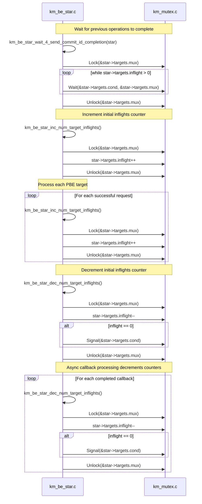

# Synchronization and Counter Management

This diagram shows the detailed synchronization mechanisms and counter management within the `km_be_star_send_commit_id` function.

```mermaid
sequenceDiagram
    participant Star as km_be_star.c
    participant Mutex as km_mutex.c

    Note over Star,Mutex: Wait for previous operations to complete
    Star->>Star: km_be_star_wait_4_send_commit_id_completion(star)
    Star->>Mutex: Lock(&star->targets.mux)
    loop while star->targets.inflight > 0
        Star->>Mutex: Wait(&star->targets.cond, &star->targets.mux)
    end
    Star->>Mutex: Unlock(&star->targets.mux)
    
    Note over Star,Mutex: Increment initial inflights counter
    Star->>Star: km_be_star_inc_num_target_inflights()
    Star->>Mutex: Lock(&star->targets.mux)
    Star->>Mutex: star->targets.inflight++
    Star->>Mutex: Unlock(&star->targets.mux)
    
    Note over Star: Process each PBE target
    
    loop For each successful request
        Star->>Star: km_be_star_inc_num_target_inflights()
        Star->>Mutex: Lock(&star->targets.mux)
        Star->>Mutex: star->targets.inflight++
        Star->>Mutex: Unlock(&star->targets.mux)
    end
    
    Note over Star,Mutex: Decrement initial inflights counter
    Star->>Star: km_be_star_dec_num_target_inflights()
    Star->>Mutex: Lock(&star->targets.mux)
    Star->>Mutex: star->targets.inflight--
    alt inflight == 0
        Star->>Mutex: Signal(&star->targets.cond)
    end
    Star->>Mutex: Unlock(&star->targets.mux)
    
    Note over Star,Mutex: Async callback processing decrements counters
    loop For each completed callback
        Star->>Star: km_be_star_dec_num_target_inflights()
        Star->>Mutex: Lock(&star->targets.mux)
        Star->>Mutex: star->targets.inflight--
        alt inflight == 0
            Star->>Mutex: Signal(&star->targets.cond)
        end
        Star->>Mutex: Unlock(&star->targets.mux)
    end
```