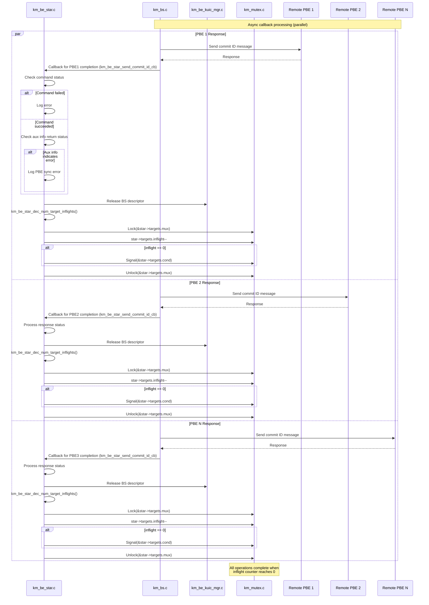

# Async Callback Processing Flow

This diagram shows how async callbacks are processed in parallel for multiple PBE instances.

```mermaid
sequenceDiagram
    participant Star as km_be_star.c
    participant BS as km_bs.c
    participant KUIC as km_be_kuic_mgr.c
    participant Mutex as km_mutex.c
    participant PBE1 as Remote PBE 1
    participant PBE2 as Remote PBE 2
    participant PBE3 as Remote PBE N

    Note over BS,PBE3: Async callback processing (parallel)
    
    par PBE 1 Response
        BS->>PBE1: Send commit ID message
        PBE1-->>BS: Response
        BS->>Star: Callback for PBE1 completion (km_be_star_send_commit_id_cb)
        Star->>Star: Check command status
        alt Command failed
            Star->>Star: Log error
        else Command succeeded
            Star->>Star: Check aux info return status
            alt Aux info indicates error
                Star->>Star: Log PBE sync error
            end
        end
        Star->>KUIC: Release BS descriptor
        Star->>Star: km_be_star_dec_num_target_inflights()
        Star->>Mutex: Lock(&star->targets.mux)
        Star->>Mutex: star->targets.inflight--
        alt inflight == 0
            Star->>Mutex: Signal(&star->targets.cond)
        end
        Star->>Mutex: Unlock(&star->targets.mux)
        
    and PBE 2 Response
        BS->>PBE2: Send commit ID message
        PBE2-->>BS: Response
        BS->>Star: Callback for PBE2 completion (km_be_star_send_commit_id_cb)
        Star->>Star: Process response status
        Star->>KUIC: Release BS descriptor
        Star->>Star: km_be_star_dec_num_target_inflights()
        Star->>Mutex: Lock(&star->targets.mux)
        Star->>Mutex: star->targets.inflight--
        alt inflight == 0
            Star->>Mutex: Signal(&star->targets.cond)
        end
        Star->>Mutex: Unlock(&star->targets.mux)
        
    and PBE N Response
        BS->>PBE3: Send commit ID message
        PBE3-->>BS: Response
        BS->>Star: Callback for PBE3 completion (km_be_star_send_commit_id_cb)
        Star->>Star: Process response status
        Star->>KUIC: Release BS descriptor
        Star->>Star: km_be_star_dec_num_target_inflights()
        Star->>Mutex: Lock(&star->targets.mux)
        Star->>Mutex: star->targets.inflight--
        alt inflight == 0
            Star->>Mutex: Signal(&star->targets.cond)
        end
        Star->>Mutex: Unlock(&star->targets.mux)
    end
    
    Note over Mutex: All operations complete when<br/>inflight counter reaches 0
```