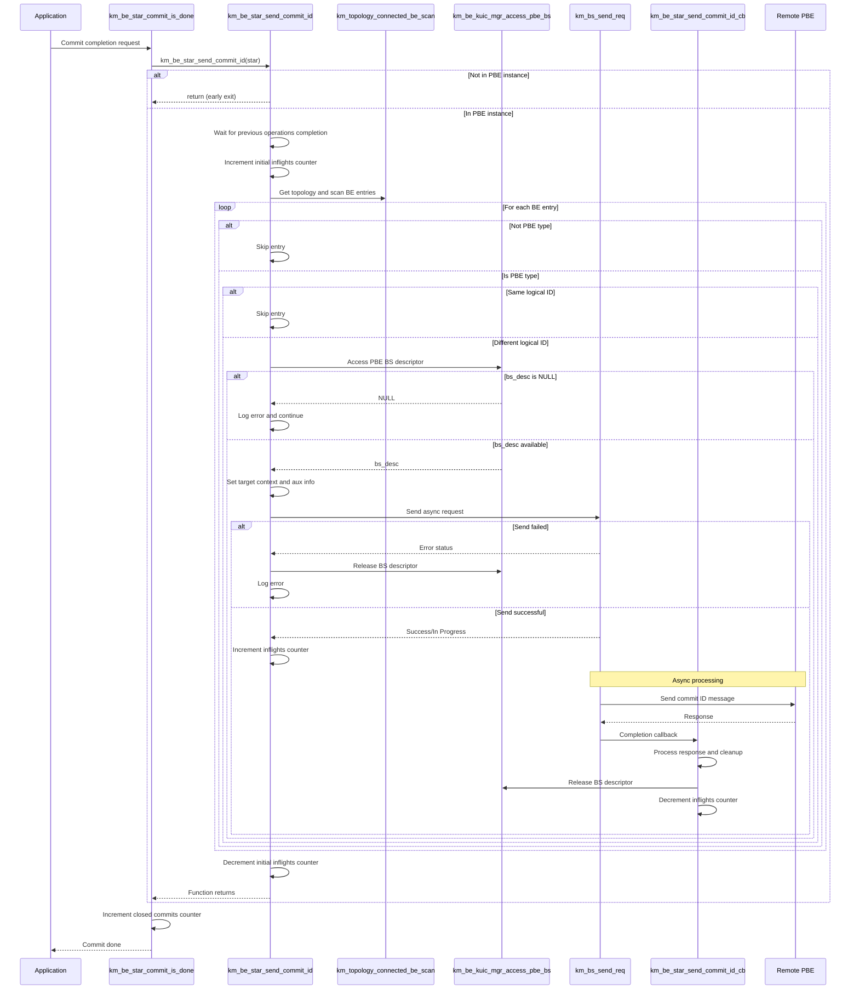

# Complete End-to-End Flow with Error Handling

This diagram shows the complete flow from application to commit completion, including all error handling paths.

```mermaid
sequenceDiagram
    participant App as Application
    participant CommitDone as km_be_star_commit_is_done
    participant SendCommit as km_be_star_send_commit_id
    participant Topology as km_topology_connected_be_scan
    participant KUIC as km_be_kuic_mgr_access_pbe_bs
    participant BS as km_bs_send_req
    participant CB as km_be_star_send_commit_id_cb
    participant PBE as Remote PBE

    App->>CommitDone: Commit completion request
    CommitDone->>SendCommit: km_be_star_send_commit_id(star)
    
    alt Not in PBE instance
        SendCommit-->>CommitDone: return (early exit)
    else In PBE instance
        SendCommit->>SendCommit: Wait for previous operations completion
        SendCommit->>SendCommit: Increment initial inflights counter
        
        SendCommit->>Topology: Get topology and scan BE entries
        loop For each BE entry
            alt Not PBE type
                SendCommit->>SendCommit: Skip entry
            else Is PBE type
                alt Same logical ID
                    SendCommit->>SendCommit: Skip entry
                else Different logical ID
                    SendCommit->>KUIC: Access PBE BS descriptor
                    alt bs_desc is NULL
                        KUIC-->>SendCommit: NULL
                        SendCommit->>SendCommit: Log error and continue
                    else bs_desc available
                        KUIC-->>SendCommit: bs_desc
                        SendCommit->>SendCommit: Set target context and aux info
                        SendCommit->>BS: Send async request
                        alt Send failed
                            BS-->>SendCommit: Error status
                            SendCommit->>KUIC: Release BS descriptor
                            SendCommit->>SendCommit: Log error
                        else Send successful
                            BS-->>SendCommit: Success/In Progress
                            SendCommit->>SendCommit: Increment inflights counter
                            
                            Note over BS,PBE: Async processing
                            BS->>PBE: Send commit ID message
                            PBE-->>BS: Response
                            BS->>CB: Completion callback
                            CB->>CB: Process response and cleanup
                            CB->>KUIC: Release BS descriptor
                            CB->>CB: Decrement inflights counter
                        end
                    end
                end
            end
        end
        
        SendCommit->>SendCommit: Decrement initial inflights counter
        SendCommit-->>CommitDone: Function returns
    end
    
    CommitDone->>CommitDone: Increment closed commits counter
    CommitDone-->>App: Commit done
```