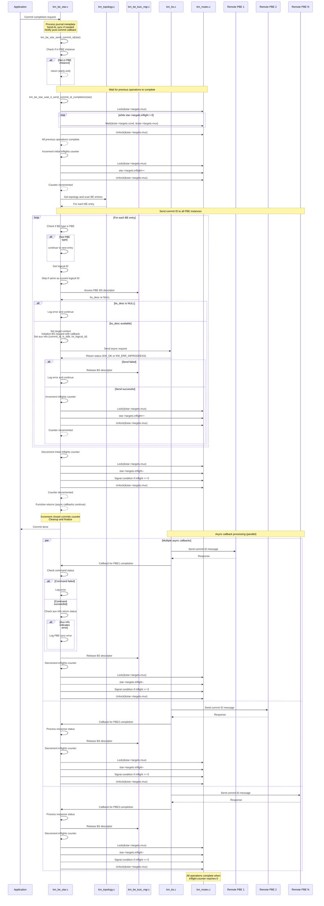

# Complete Original Sequence Diagram

This is the complete, detailed sequence diagram as provided, showing all interactions with the updated participant names.

```mermaid
sequenceDiagram
    participant App as Application
    participant Star as km_be_star.c
    participant Topology as km_topology.c
    participant KUIC as km_be_kuic_mgr.c
    participant BS as km_bs.c
    participant Mutex as km_mutex.c
    participant PBE1 as Remote PBE 1
    participant PBE2 as Remote PBE 2
    participant PBE3 as Remote PBE N

    App->>Star: Commit completion request
    Note over Star: Process journal metadata<br/>Send AL sync if needed<br/>Notify post-commit callback
    
    Star->>Star: km_be_star_send_commit_id(star)
    
    Star->>Star: Check if in PBE instance
    alt Not in PBE instance
        Star-->>Star: return (early exit)
    end
    
    Note over Star,Mutex: Wait for previous operations to complete
    Star->>Star: km_be_star_wait_4_send_commit_id_completion(star)
    Star->>Mutex: Lock(&star->targets.mux)
    loop while star->targets.inflight > 0
        Star->>Mutex: Wait(&star->targets.cond, &star->targets.mux)
    end
    Star->>Mutex: Unlock(&star->targets.mux)
    Star-->>Star: All previous operations complete
    
    Star->>Star: Increment initial inflights counter
    Star->>Mutex: Lock(&star->targets.mux)
    Star->>Mutex: star->targets.inflight++
    Star->>Mutex: Unlock(&star->targets.mux)
    Star-->>Star: Counter incremented
    
    Star->>Topology: Get topology and scan BE entries
    Topology-->>Star: For each BE entry
    
    Note over Star,PBE3: Send commit ID to all PBE instances
    loop For each BE entry
        Star->>Star: Check if BE type is PBE
        alt Not PBE type
            Star->>Star: continue to next entry
        end
        
        Star->>Star: Get logical ID
        Star->>Star: Skip if same as current logical ID
        
        Star->>KUIC: Access PBE BS descriptor
        KUIC-->>Star: bs_desc or NULL
        
        alt bs_desc is NULL
            Star->>Star: Log error and continue
        else bs_desc available
            Star->>Star: Set target context<br/>Initialize BS request with callback<br/>Set aux info (commit_id, is_ddb, ini_logical_id)
            Star->>BS: Send async request
            BS-->>Star: Return status (KM_OK or KM_ERR_INPROGRESS)
            
            alt Send failed
                Star->>KUIC: Release BS descriptor
                Star->>Star: Log error and continue
            else Send successful
                Star->>Star: Increment inflights counter
                Star->>Mutex: Lock(&star->targets.mux)
                Star->>Mutex: star->targets.inflight++
                Star->>Mutex: Unlock(&star->targets.mux)
                Star-->>Star: Counter incremented
            end
        end
    end
    
    Star->>Star: Decrement initial inflights counter
    Star->>Mutex: Lock(&star->targets.mux)
    Star->>Mutex: star->targets.inflight--
    Star->>Mutex: Signal condition if inflight == 0
    Star->>Mutex: Unlock(&star->targets.mux)
    Star-->>Star: Counter decremented
    
    Star-->>Star: Function returns (async callbacks continue)
    
    Note over Star: Increment closed commits counter<br/>Cleanup and finalize
    Star-->>App: Commit done
    
    Note over BS,PBE3: Async callback processing (parallel)
    par Multiple async callbacks
        BS->>PBE1: Send commit ID message
        PBE1-->>BS: Response
        BS->>Star: Callback for PBE1 completion
        Star->>Star: Check command status
        alt Command failed
            Star->>Star: Log error
        else Command succeeded
            Star->>Star: Check aux info return status
            alt Aux info indicates error
                Star->>Star: Log PBE sync error
            end
        end
        Star->>KUIC: Release BS descriptor
        Star->>Star: Decrement inflights counter
        Star->>Mutex: Lock(&star->targets.mux)
        Star->>Mutex: star->targets.inflight--
        Star->>Mutex: Signal condition if inflight == 0
        Star->>Mutex: Unlock(&star->targets.mux)
    and
        BS->>PBE2: Send commit ID message
        PBE2-->>BS: Response
        BS->>Star: Callback for PBE2 completion
        Star->>Star: Process response status
        Star->>KUIC: Release BS descriptor
        Star->>Star: Decrement inflights counter
        Star->>Mutex: Lock(&star->targets.mux)
        Star->>Mutex: star->targets.inflight--
        Star->>Mutex: Signal condition if inflight == 0
        Star->>Mutex: Unlock(&star->targets.mux)
    and
        BS->>PBE3: Send commit ID message
        PBE3-->>BS: Response
        BS->>Star: Callback for PBE3 completion
        Star->>Star: Process response status
        Star->>KUIC: Release BS descriptor
        Star->>Star: Decrement inflights counter
        Star->>Mutex: Lock(&star->targets.mux)
        Star->>Mutex: star->targets.inflight--
        Star->>Mutex: Signal condition if inflight == 0
        Star->>Mutex: Unlock(&star->targets.mux)
    end
    
    Note over Mutex: All operations complete when<br/>inflight counter reaches 0
```